# Search Sphere

> **Search Sphere** is an enterprise-grade document semantic-search and grounded Retrieval-Augmented Generation (RAG) system. It combines hybrid dense-sparse vector retrieval, cross-encoder reranking, and conversational query rewriting to deliver hallucination-resistant answers with verifiable, chunk-level citations. Engineered with strict multi-tenant isolation, real-time Server-Sent Events (SSE) streaming, and an automated evaluation benchmark framework.

---

## 🏛 Architecture

### End-to-End System Pipeline

```mermaid
flowchart TD
    subgraph Ingestion["Document Ingestion Pipeline (Worker)"]
        A[User Uploads PDF] --> B[File Validation & Storage]
        B --> C[Metadata in PostgreSQL]
        C --> D[Dramatiq Task Queue via RabbitMQ]
        D --> E[Text & Layout Extraction]
        E --> F[Structure-Preserving Text Cleaner]
        F --> G[Sliding Window Chunking]
        G --> H1[Dense Embeddings: all-MiniLM-L6-v2]
        G --> H2[Sparse Vectors: BM25]
        H1 & H2 --> I[(Qdrant Vector DB)]
    end

    subgraph RAG["Grounded RAG & Retrieval Pipeline (API)"]
        Q[User Query / Follow-up] --> R[Query Rewriter: Cohere]
        R --> S1[Dense Retrieval] & S2[BM25 Sparse Retrieval]
        S1 & S2 --> T[Reciprocal Rank Fusion - RRF]
        T --> U[Cross-Encoder Reranker: ms-marco-MiniLM-L-6-v2]
        U --> V[Top-K Context Construction]
        V --> W[Grounded Synthesis: Cohere]
        W --> X[SSE Stream: Tokens + Inline Citations]
        X --> Y[Persistent Conversation & Feedback DB]
    end
```



---

## 🛠 Tech Stack

| Category | Technologies |
| :--- | :--- |
| **Frontend** | Next.js 16 (App Router), React 19, TypeScript, Tailwind CSS, shadcn/ui, TanStack Query v5 |
| **Backend API** | FastAPI, Python 3.12, Uvicorn, Pydantic v2, asyncpg, SQLAlchemy 2.0, Alembic |
| **Background Worker** | Dramatiq, Python 3.12, Watchdog, PyMuPDF (`fitz`), Pillow, PyPDF |
| **Relational Database** | PostgreSQL 16+ (Supabase / AWS RDS / Self-hosted) with Alembic versioned migrations |
| **Vector Database** | Qdrant (Dense cosine vectors + BM25 sparse vectors with payload indexing) |
| **Message Broker** | RabbitMQ 3 (AMQP task queue with health checks and durable persistence) |
| **Cache & Store** | Redis 7 (ephemeral caching, query state, and rate limiting) |
| **AI / ML Models** | `sentence-transformers/all-MiniLM-L6-v2` (Dense), `Qdrant/bm25` (Sparse), `cross-encoder/ms-marco-MiniLM-L-6-v2` (Reranker), Cohere `command-a-03-2025` (LLM) |
| **Observability & Security** | Structlog (correlated `request_id`), Langfuse tracing, PyJWT (HS256), SlowAPI / Token-bucket rate limiting |
| **Testing & CI/CD** | Pytest, Pytest-Asyncio, Vitest, Testing Library, Ruff, Mypy, GitHub Actions |

---

## ✨ Key Engineering Highlights

- **Multi-Tenant RAG Microservice Platform**: Serves Search-Sphere's standalone web application alongside multiple independent external client systems (such as Quick-Clinic healthcare or ExamArena ed-tech) with authoritative client authentication, tenant isolation, and collections.
- **Official Client SDKs**: Lightweight Python (`clients/python`) and TypeScript (`clients/typescript`) SDKs for seamless microservice integration without importing internal Python backend dependencies.
- **Hybrid Dense + Sparse Retrieval**: Combines semantic embeddings (`all-MiniLM-L6-v2`) for conceptual similarity with BM25 sparse representations for exact keyword/part-number matching.
- **Reciprocal Rank Fusion (RRF)**: Merges disparate rank lists using reciprocal rank scores ($k=60$), ensuring balanced candidate selection prior to reranking.
- **Cross-Encoder Reranking**: Re-evaluates top-K retrieval candidates using `cross-encoder/ms-marco-MiniLM-L-6-v2`, performing full cross-attention between the query and each chunk to maximize precision.
- **Conversational Query Rewriting**: Resolves ambiguous pronouns, coreferences, and missing context from chat history before querying the vector store.
- **Strict Groundedness & Verifiable Citations**: Enforces structured prompt constraints ensuring the model refuses when evidence is insufficient and attributes statements to specific chunk and page references (`[1]`, `[2]`).
- **Defense-in-Depth Multi-Tenant Isolation**: Guarantees zero data leakage across tenants by enforcing authorization checks at PostgreSQL query boundaries and vector payload filter predicates (`client_id`, `tenant_id`, `collection_id`).
- **Real-Time SSE Streaming**: Emits live token-by-token responses over Server-Sent Events alongside preliminary metadata, source citations, and completion telemetry.
- **Persistent Conversation Threads & Feedback**: Persists multi-turn conversations and message-level feedback (upvotes/downvotes) for reinforcement analysis.
- **Automated RAG Evaluation Suite**: Custom benchmark framework measuring retrieval accuracy and generation quality against synthetic and domain-specific test sets.

---

## 🌐 Multi-Tenant Microservice & Client SDKs

Search Sphere functions as both a standalone web application and a central headless RAG platform. External services authenticate with scoped API keys and access versioned REST endpoints:

- **Architecture Overview**: Detailed security model and domain adapter patterns are documented in [`docs/MICROSERVICE_ARCHITECTURE.md`](docs/MICROSERVICE_ARCHITECTURE.md).
- **ExamArena Integration Guide**: Walkthrough of a non-medical client integration is in [`docs/EXAMARENA_INTEGRATION.md`](docs/EXAMARENA_INTEGRATION.md).
- **Architecture Audit**: Analysis of generic vs domain-specific medical concerns in [`ARCHITECTURE_AUDIT.md`](ARCHITECTURE_AUDIT.md).

### Versioned API (`/api/v1/`)

| Method | Endpoint | Description | Required Scope |
| :--- | :--- | :--- | :--- |
| `POST` | `/api/v1/clients` | Register a new client application and issue API key | Admin |
| `GET` | `/api/v1/clients/me` | Inspect authenticated client identity and tenant grants | None |
| `POST` | `/api/v1/collections` | Create a document collection for a tenant | `collections:manage` |
| `GET` | `/api/v1/collections` | List authorized collections for the tenant | `documents:read` |
| `DELETE` | `/api/v1/collections/{id}` | Delete collection and its indexed vectors | `collections:manage` |
| `POST` | `/api/v1/documents/upload` | Multipart file upload and asynchronous ingestion | `documents:write` |
| `POST` | `/api/v1/documents` | Register pre-uploaded object storage document | `documents:write` |
| `GET` | `/api/v1/documents/{id}/status` | Check asynchronous processing and vector index status | `documents:read` |
| `GET` | `/api/v1/documents` | List documents scoped to tenant and collection | `documents:read` |
| `DELETE` | `/api/v1/documents/{id}` | Delete document from PostgreSQL, Qdrant, and storage | `documents:delete` |
| `POST` | `/api/v1/search` | Scoped hybrid dense-sparse semantic retrieval | `search:execute` |
| `POST` | `/api/v1/answers` | Generate grounded, citation-backed RAG answers | `answers:generate` |
| `POST` | `/api/v1/answers/stream` | Stream grounded RAG answer tokens via SSE | `answers:generate` |

### Python Client SDK Usage

```python
from search_sphere import SearchSphereClient

client = SearchSphereClient(
    base_url="http://localhost:8000",
    api_key="ss_live_...",
    tenant_id="school_cbse_10",
)

# Semantic search within a collection
results = client.search(
    query="Newton's laws of motion",
    collection_id="physics_class_10",
    limit=5,
)
for r in results.results:
    print(f"[{r.score:.2f}] {r.file_name}: {r.text[:80]}...")

# Grounded answer generation
answer = client.generate_answer(
    query="Explain inertia with formula",
    collection_id="physics_class_10",
)
print(answer.answer)
```

### TypeScript Client SDK Usage

```typescript
import { SearchSphereClient } from "@search-sphere/client";

const client = new SearchSphereClient({
  baseUrl: "http://localhost:8000",
  apiKey: "ss_live_...",
  tenantId: "school_cbse_10",
});

const answer = await client.generateAnswer({
  query: "Explain inertia with formula",
  collectionId: "physics_class_10",
});
console.log(answer.answer);
```

---

## 📊 RAG Evaluation Benchmark Results

The offline evaluator (`apps/api/src/evaluation/run_eval.py`) checks metrics against preset outputs for 30 synthetic cases across 7 categories. These scores verify evaluator behavior; they do not measure live retrieval or Cohere answer quality:

| Metric | Target | Benchmark Score | Status |
| :--- | :--- | :--- | :--- |
| **Recall@5** | $\ge 0.85$ | **1.0000** | PASS |
| **Precision@5** | $\ge 0.70$ | **0.7667** | PASS |
| **MRR (Mean Reciprocal Rank)** | $\ge 0.80$ | **1.0000** | PASS |
| **nDCG@5** | $\ge 0.80$ | **1.0000** | PASS |
| **Citation Validity Rate** | $\ge 90\%$ | **100.0%** | PASS |
| **No-Evidence Refusal Accuracy** | $\ge 90\%$ | **100.0%** | PASS |
| **Keyword Coverage** | $\ge 80\%$ | **93.5%** | PASS |

Run `make eval` to regenerate a temporary local report. Remove generated reports after reviewing them.

---

## 📸 Screenshots & UI Preview

<!-- SCREENSHOTS_START -->
> _UI preview screenshots can be captured directly from the local running web service at `http://localhost:3000`._

| Document Ingestion & Management | Grounded Semantic Search & Q&A |
| :---: | :---: |
| *Upload, status tracking, and chunk inspection* | *Multi-turn chat with streaming tokens & citations* |
| *(Capture from `/documents`)* | *(Capture from `/search` or `/conversations`)* |

*To generate screenshot assets:*
1. Start the services: `make up`
2. Open `http://localhost:3000` in your browser.
3. Save screenshots into `docs/screenshots/` and update references here.
<!-- SCREENSHOTS_END -->

---

## ⚡ Quick Start & Local Setup

### 1. Prerequisites
- Docker Engine & Docker Compose (`docker compose version` $\ge$ 2.20)
- Node.js 20+ & pnpm (for local frontend development)
- Python 3.12 (for local backend development)
- Make (optional, for CLI shortcuts)

### 2. Configure Environment
```bash
cp .env.example .env
```
Update `.env` with your API keys (e.g. `COHERE_API_KEY`, Supabase or local DB credentials).

### 3. Start Local Full Stack
```bash
# Build and start all 7 services (web, api, worker, postgres, redis, rabbitmq, qdrant)
make build
make up

# Run Alembic schema migrations
make migrate
```

### 4. Access Local Interfaces
- **Next.js Web UI**: [http://localhost:3000](http://localhost:3000)
- **FastAPI OpenAPI Docs**: [http://localhost:8000/docs](http://localhost:8000/docs)
- **FastAPI Health Probe**: [http://localhost:8000/health](http://localhost:8000/health)
- **RabbitMQ Management UI**: [http://localhost:15672](http://localhost:15672) (guest:guest)

---

## 🧪 Testing & Verification

```bash
# Run backend test suite (105+ tests including E2E lifecycle & tenant isolation)
make test
# or: docker compose exec api pytest

# Run worker test suite (330+ tests for OCR, chunking, and vector indexing)
make test-worker

# Run RAG evaluation benchmark
make eval

# Run frontend linting, tests, and production build
cd apps/web
pnpm lint
pnpm test
pnpm build
```

---

## 🚢 Production Deployment

Search Sphere is **deployment-ready**. For architecture runbooks, cloud provider configurations, production commands, and the 12-step release checklist, see:

👉 [**Production Deployment Guide & Runbook (`DEPLOYMENT.md`)**](DEPLOYMENT.md)

---

## 📄 License

This project is licensed under the MIT License.
